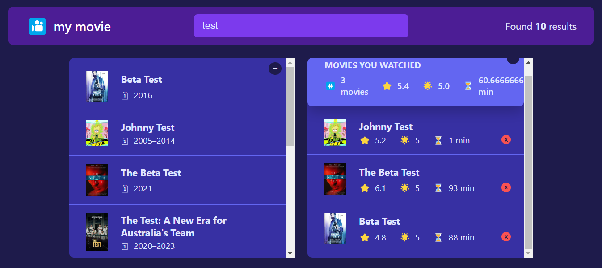

# Movie Hub
Movie Hub is an engaging web application developed using React.js and CSS, designed to be your go-to platform for exploring and organizing your favorite movies. Powered by the OMDB API, the hub seamlessly fetches comprehensive movie data, offering users a rich and dynamic browsing experience.

